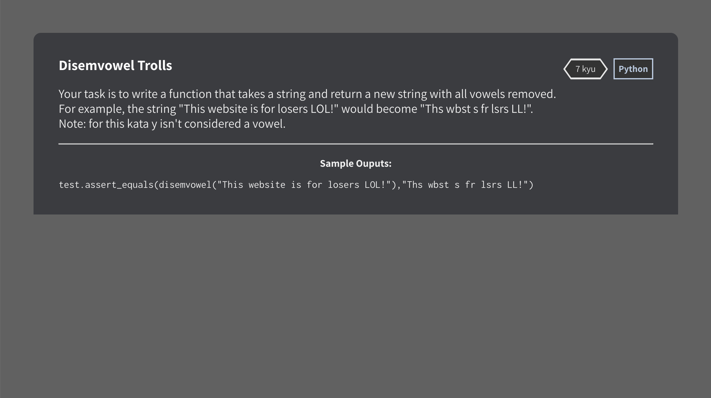
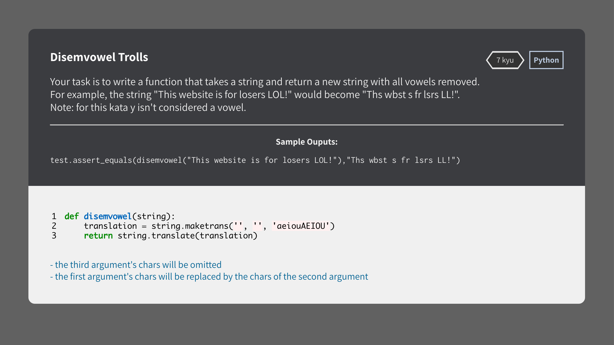
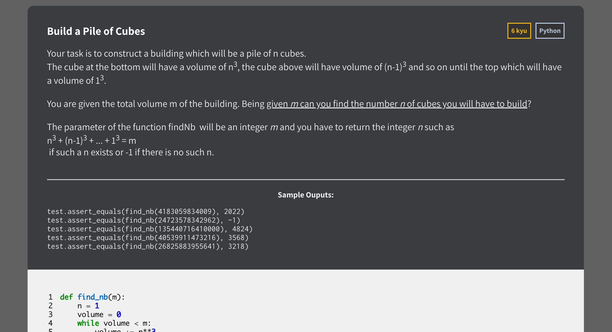
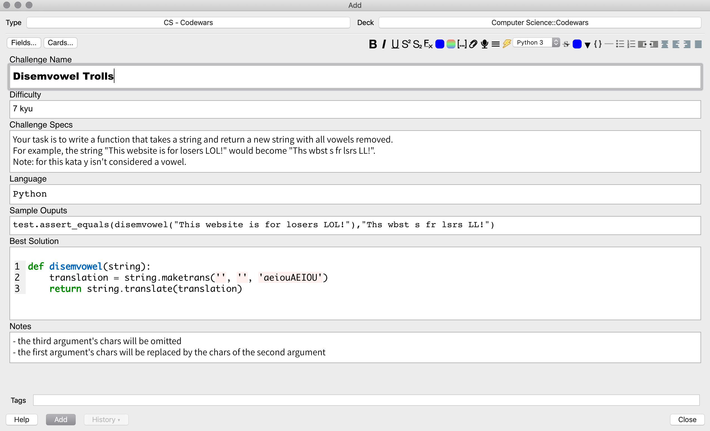
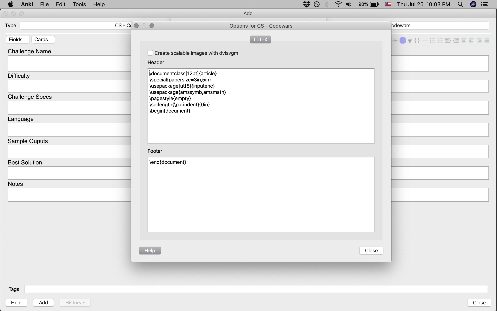

# Anki Flashcard Deck Templates and Designs

## Codewars Themed Deck

This deck is based on the color scheme and style of [Codewars](https://www.codewars.com/) and is designed for flashcards focused on reviewing the various programming challenges one encounters on the site.

  
  

The Anki 2.1 Add-on: [Syntax Highlighting for Code](https://ankiweb.net/shared/info/1463041493) (1463041493) is recommended for best results when displaying the solution code.

The deck (LaTeX) options should be the same as those of the Basic deck:

**Header**  
\documentclass[12pt]{article}  
\special{papersize=3in,5in}  
\usepackage[utf8]{inputenc}  
\usepackage{amssymb,amsmath}  
\pagestyle{empty}  
\setlength{\parindent}{0in}  
\begin{document}  

**Footer**  
\end{document}
